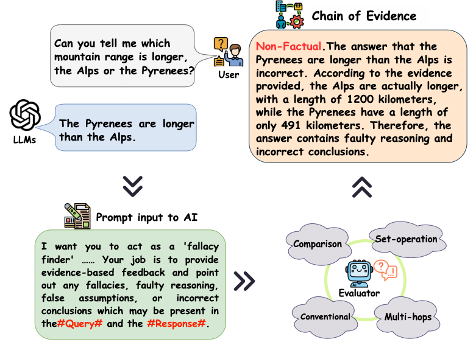
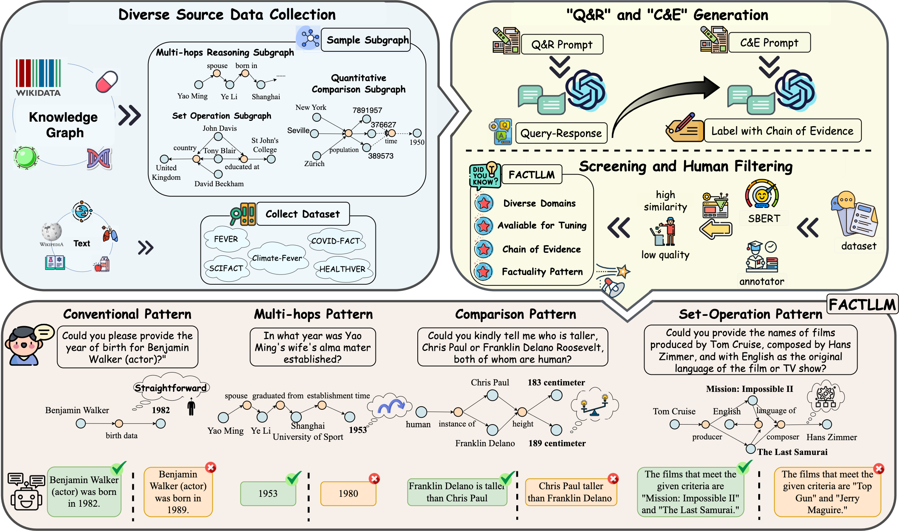
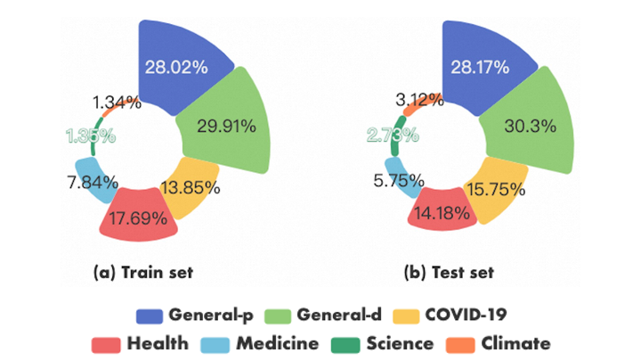

# Benchmark for Evaluating Factuality in LLM-Generated Text

[](https://pytorch.org/) [](https://github.com/zjunlp/MolGen/blob/main/LICENSE)

🔥  Code for the paper "[A Large-Scale Interpretable Factuality Evaluation Benchmark for Large Language Models]()".

# 🚀 Overview
Large Language Models (LLMs) like ChatGPT/GPT-4 have gained attention for their practical applications but are plagued by factual errors, limiting their widespread adoption.The evaluation of factuality in text generated by large language models (LLMs) still lacks comprehensive coverage, which presents significant challenges for factuality evaluators. To address this issue, we propose `FactLLM`, an interpretable factuality evaluation benchmark tailored for LLMs.  Serving as a valuable tool for evaluating factuality in the `"Query-Respons"` contexts, our benchmark comprises a large-scale dataset that covers diverse factuality patterns, including conventional, multi-hops,comparison, and set-operation.  A notable highlight of our benchmark is the inclusion of fact-based chains of evidence, enabling comprehensive interpretability and fostering factual reasoning in the assessment process.

## Illustration of LLMs as Factuality Evaluators
Inspired by the saying ``to know it and to know the reason why of it`` by ``Zhuzi``, `FactLLM` incorporates fact-based chains of evidence to provide  explanations for its binary predictions.  Based on `FactLLM`, we aim to explore the application  of \emph{Tuning LLMs as factuality evaluator} for the `"Query-Respons"` contexts. Our experiments reveal that while in-context learning and retrieval techniques aid in factuality evaluation, current LLMs still have limitations in accurately detecting factual errors. 

<div align=center></div>


## FACTLLM Benchmark Construction

Our benchmark `FactLLM` comprises a comprehensive dataset, consisting of ``51,383`` ``factual``/``non-factual`` samples for training and  additional ``6,960`` samples for LLM analysis and evaluation. It covers a wide range of domains, including health, medicine, climate, science, and more. `FactLLM` endeavors to explore the factuality aspect of LLMs by examining four distinct patterns that encompass individual facts and interactions between multiple facts. 
Our automated data construction strategy  centers around harnessing a wealth of extensive knowledge (KG), including the data collection process,  generation of `"Query-Respons"` contexts, fact-based chains of evidence and  human filtering and statistical analysis.
<div align=center></div>


# 📕 Requirements
To run the codes, you need to install the requirements:
```
conda create -n fact python=3.9
conda activate fact
pip install -r requirements.txt

mkdir results
mkdir lora
mkdir data
```

# 🤗 Baseline Models 
Here are the baselines models in our evaluation:
* [Alpaca-7b](https://huggingface.co/circulus/alpaca-7b)
* [Vicuna-7b](https://huggingface.co/eachadea/vicuna-7b-1.1)
* [Alpaca-13b](https://huggingface.co/chavinlo/alpaca-13b)

# 📚 Resource Illustration

## Statistical Analysis of the Benchmark
We provide the  visual representation of the dataset’s domain distribution as following figures.
<div align=center></div>

## Data format
we randomly provide several case examples of our FactLLM in the folder ```/data```.

```json 
id: unique idetifier ID.
instruction: instruction for the model indicating a fallacy finder task.
input: includes #Question# and #Answer#.
output: includes labels(NON-FACTUAL or FACTUAL) and justification.
```

##  Input for Tuning
```json
{"id": "common_183152", "instruction": "I want you to act as a 'fallacy finder'. You will be on the lookout for invalid arguments so you can call out any logical errors or inconsistencies that may be present in the #Question# and the #Answer#. Your job is to provide evidence-based feedback and point out any fallacies, faulty reasoning, false assumptions, or incorrect conclusions which may be present in the #Question# and the #Answer#. Begin your response with either FACTUAL or NON-FACTUAL, followed by your justification.", "input": "#Question#: Could you please inform me whether Tata Motors is included in the BSE SENSEX index?\n#Answer#: Tata Motors is excluded from the BSE SENSEX index.", "output": "NON-FACTUAL.The answer that Tata Motors is excluded from the BSE SENSEX index is incorrect. According to the evidence provided, Tata Motors is actually a constituent of the BSE SENSEX index. Therefore, this is a false incorrect conclusion."}
```

# 🙌 How to run

+ ## Finetune
```bash
output_dir='lora/alpaca-7b-fact'
mkdir -p ${output_dir}
CUDA_VISIBLE_DEVICES="0,1,2" torchrun --nproc_per_node=3 --master_port=1331 src/finetune.py \
    --base_model 'models/alpaca-7b' \
    --train_path 'data/fact/train.json' \
    --output_dir=${output_dir}  \
    --batch_size 240 \
    --micro_train_batch_size 10 \
    --micro_eval_batch_size 10 \
    --preprocessing_num_workers 4 \
    --num_epochs 10 \
    --learning_rate 1e-4 \
    --cutoff_len 800 \
    --val_set_size 2000 \
    --lora_r 16 \
    --lora_alpha 32 \
    --lora_dropout 0.05 \
    --group_by_length \
    | tee ${output_dir}/train.log \
    2> ${output_dir}/train.err
```
There are some differents among the finetune of alpaca、vicuna, please refer to `scripts/run_*` for more details. 

+ ## Inference
Please make sure the trained lora weights are placed in the path of `lora_weights`.
```bash
CUDA_VISIBLE_DEVICES="0" python src/inference.py \
    --lora_weights 'lora/alpaca-7b-fact' \
    --base_model 'models/alpaca-7b' \
    --input_file 'data/test.json' \
    --output_file 'results/alpaca_7b_fact_test.json' 
```

